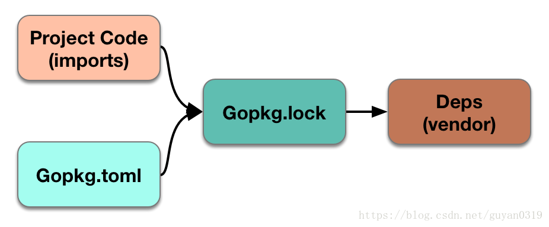

### 前言

大家都知道go没有一个自己的包管理平台。社区里go的第三方包托管在各个git托管平台。需要用到包时通过go get 命令工具安装，但这个工具没有版本描述性文件，在go的世界里没有“package.json”这种文件。这个给我们带来直接的影响就是依赖放在外网，而且没有版本约束，这个月下的版本，可能下个月更新了。有道是“工欲善其事，必先利其器”，这个时候我们就需要一个依赖管理工具。
目前依赖工具有很多，如：**glide**、**godep**等。今天主要讲是官方出品的**dep**,注意它和**godep**不是一个东西。
github地址不同

-   **godep :   https://github.com/tools/godep**

-   **dep:   https://github.com/golang/dep**

按照**Peter Bourgon**博文来说，它们的作者都有相同的人，但是一个是**dep**是官方版本，**godep**是第三方工具。

<div>
<font color="#0000FF">选择dep有什么好处呢？</font>
<p style="color: #FF7F50">1、官方出的，不用担心更新维护问题。</p>
<p style="color: #FF7F50">2、相对来说，比其他第三方工具兼容问题要好。
还有等用过以后再补。</p>
</div>


### 环境要求

Golang >= 1.9

#### 安装

On other platforms you can use the install.sh script:

```go
$ curl https://raw.githubusercontent.com/golang/dep/master/install.sh | sh
//或者
go get -u github.com/golang/dep/cmd/dep
```

安装完成，查看DEP版本

```go
$ dep version  
```

输出

```go
dep:
 version     : v0.5.0
 build date  : 2018-07-26
 git hash    : 224a564
 go version  : go1.10.3
 go compiler : gc
 platform    : linux/amd64
 features    : ImportDuringSolve=false
```


#### 初始化

```go
mkdir $GOPATH/src/test
cd  $GOPATH/src/test
dep init
```

test目录生成如下文件

```go
├── Gopkg.lock
├── Gopkg.toml
└── vendor
```

其中

-   Gopkg.lock 是生成的文件，不要手工修改 Gopkg.lock 官方文档。

-   Gopkg.toml 是依赖管理的核心文件，可以生成也可以手动修改，
    一般情况下Gopkg.toml里面只定义直接依赖项，而Gopkg.lock里面除了包含Gopkg.toml中的所有项之外，还包含传递依赖项。比如我们的项目依赖项目A， 而项目A又依赖B、C，那么只有A会包含在Gopkg.toml中，而A、B、C都会定义在Gopkg.lock中。所以Gopkg.lock定义了所有依赖的项目的详细信息（commit ID和packages），使得每次build我们自己的项目时，始终基于确定不变的依赖项。Gopkg.toml 官方文档。

-   vendor目录是 golang1.5 以后依赖管理目录，这个目录的依赖代码是优先加载的，类似 node 的 node_module 目录。
    三个之间的关系

    

### 依赖管理

```go
# 依赖管理帮助

dep help ensure
# 添加一条依赖
dep ensure -add github.com/bitly/go-simplejson
# 这里 @= 参数指定的是 某个 tag
dep ensure -add github.com/bitly/go-simplejson@=0.4.3
# 添加后一定记住执行 确保 同步
dep ensure
# 建议使用
dep ensure -v
#  删除没有用到的 package
dep prune -v
```

参数-v，是为了更好的查看执行过程，建议加上。

### 依赖更新

```go
dep ensure -update -v 
```

#### 实例

下面通过实例展示dep具体的功能
在目录 `$ GOPATH/src/test`下,创建 main.go 文件

```go
package main

import (
    "net/http"
    "os"

    "github.com/gorilla/mux"
)

func main() {
    r := mux.NewRouter()
    r.Handle("/", http.FileServer(http.Dir(".")))
    http.ListenAndServe(":"+os.Getenv("PORT"), r)
}
```
这个时候如果直接执行更新依赖

```go
dep ensure -update -v
```

你会发现Gopkg.lock没有变化，仅Gopkg.toml和vendor发生了变。
Gopkg.toml

```go
# This file is autogenerated, do not edit; changes may be undone by the next 'dep ensure'.


[[projects]]
  digest = "1:c79fb010be38a59d657c48c6ba1d003a8aa651fa56b579d959d74573b7dff8e1"
  name = "github.com/gorilla/context"
  packages = ["."]
  pruneopts = "UT"
  revision = "08b5f424b9271eedf6f9f0ce86cb9396ed337a42"
  version = "v1.1.1"

[[projects]]
  digest = "1:e73f5b0152105f18bc131fba127d9949305c8693f8a762588a82a48f61756f5f"
  name = "github.com/gorilla/mux"
  packages = ["."]
  pruneopts = "UT"
  revision = "e3702bed27f0d39777b0b37b664b6280e8ef8fbf"
  version = "v1.6.2"

[solve-meta]
  analyzer-name = "dep"
  analyzer-version = 1
  input-imports = ["github.com/gorilla/mux"]
  solver-name = "gps-cdcl"
  solver-version = 1
```

vendor下有一下文件

```go
 $ tree
.
└── github.com
    └── gorilla
        ├── context
        │   ├── context.go
        │   ├── doc.go
        │   ├── LICENSE
        │   └── README.md
        └── mux
            ├── context_gorilla.go
            ├── context_native.go
            ├── doc.go
            ├── ISSUE_TEMPLATE.md
            ├── LICENSE
            ├── middleware.go
            ├── mux.go
            ├── README.md
            ├── regexp.go
            ├── route.go
            └── test_helpers.go
```

**dep ensure -add**会更新**Gopkg.toml**和**Gopkg.lock**并安装依赖项至**vendor/**下，需要执行**dep ensure -add **，以**github.com/apodemakeles/ugo/time**为例

```go
dep ensure -add github.com/apodemakeles/ugo/time
```

这时候会报如下信息

```shell
"github.com/apodemakeles/ugo/time" is not imported by your project, and has been temporarily added to Gopkg.lock and vendor/.
If you run "dep ensure" again before actually importing it, it will disappear from Gopkg.lock and vendor/.
```

它说你没有在你的代码中使用这个新的依赖项。现在让我们来看看Gopkg.toml文件。

```go
# Gopkg.toml example

#
# Refer to https://golang.github.io/dep/docs/Gopkg.toml.html
# for detailed Gopkg.toml documentation.
#
# required = ["github.com/user/thing/cmd/thing"]
# ignored = ["github.com/user/project/pkgX", "bitbucket.org/user/project/pkgA/pkgY"]
#
# [[constraint]]
#   name = "github.com/user/project"
#   version = "1.0.0"
#
# [[constraint]]
#   name = "github.com/user/project2"
#   branch = "dev"
#   source = "github.com/myfork/project2"
#
# [[override]]
#   name = "github.com/x/y"
#   version = "2.4.0"
#
# [prune]
#   non-go = false
#   go-tests = true
#   unused-packages = true


[prune]
  go-tests = true
  unused-packages = true


[[constraint]]
  name = "github.com/apodemakeles/ugo"
  version = "0.3.0"
```

这个时候Gopkg.toml文件多了[[constraint]]信息，同时在vendor文件夹和修改.lock文件中安装最新版本。这个时候执行dep ensure 会报错误

```go
Warning: the following project(s) have [[constraint]] stanzas in Gopkg.toml:

  ✗  github.com/apodemakeles/ugo

However, these projects are not direct dependencies of the current project:
they are not imported in any .go files, nor are they in the 'required' list in
Gopkg.toml. Dep only applies [[constraint]] rules to direct dependencies, so
these rules will have no effect.

Either import/require packages from these projects so that they become direct
dependencies, or convert each [[constraint]] to an [[override]] to enforce rules
on these projects, if they happen to be transitive dependencies.

```

如果不想报错只需import代码中的依赖项，如下所示：

```go
import "github.com/apodemakeles/ugo/time"
```

然后执行dep ensure。
一般在项目中新增代码，只需执行dep ensure，它将在vendor文件夹和修改.lock文件中安装最新版本。

### 查看依赖状态

通过执行dep status命令，将列出您的应用程序中使用的版本以及开发人员发布的最新版本。

```go
PROJECT                     CONSTRAINT  VERSION  REVISION  LATEST  PKGS USED
github.com/gorilla/context  v1.1.1      v1.1.1   08b5f42   v1.1.1  1  
github.com/gorilla/mux      v1.6.2      v1.6.2   e3702be   v1.6.2  1 
```

### 删除依赖

修改**Gopkg.toml**文件相应内容，同时要保证代码中没有引用，再执行**dep ensure **或**dep ensure -update **均可。
参考
https://golang.github.io/dep/docs/introduction.html
https://jjude.com/go-dep/

