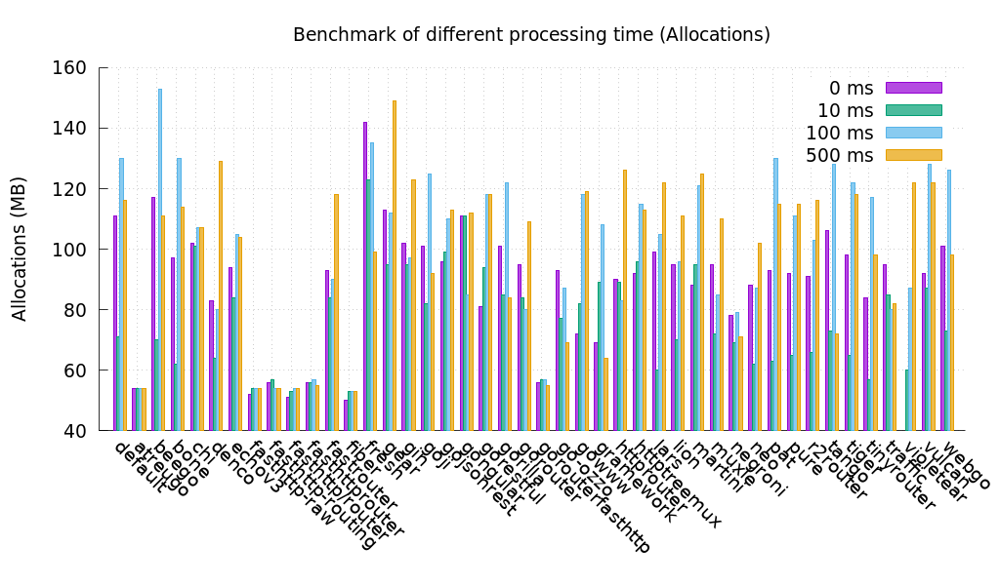
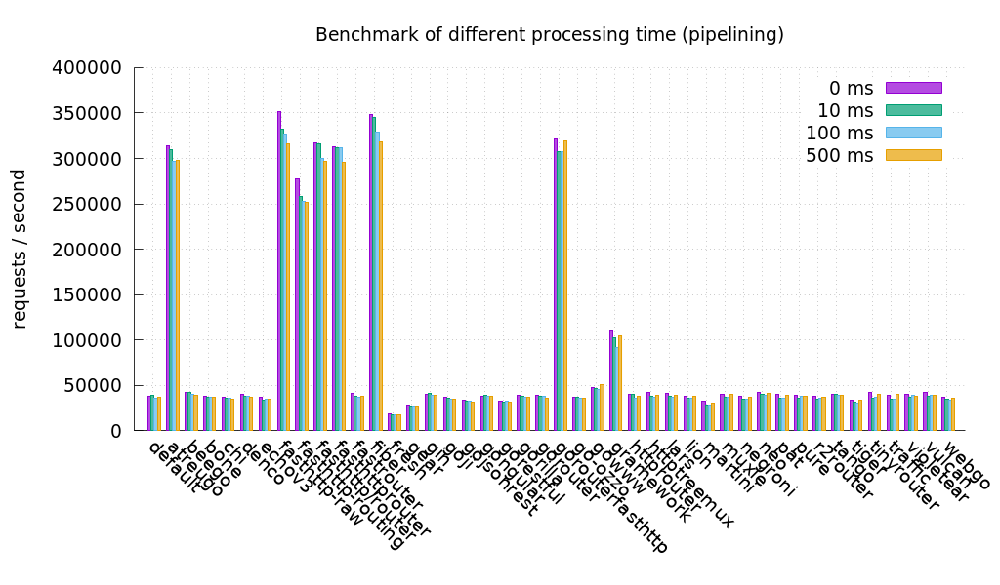

# FIBER一个GO语言构建的高效、极速、极简的WEB框架

标签： [Go语言](https://www.freesion.com/tag/Go语言/) [go](https://www.freesion.com/tag/go/) [fiber](https://www.freesion.com/tag/fiber/) [web框架](https://www.freesion.com/tag/web框架/) [后端](https://www.freesion.com/tag/后端/)

# FIBER：高效、极速、极简的WEB框架

>   Go 语言构建的 Web 框架一大堆，Beego、Iris、Gin 等 。今天带来一个足够有吸引力的新的Web框架。
>
>   不同于其他的框架，他的性能极佳，代码量又足够小，上手和使用都能使你有驾轻就熟的感觉。

**Fiber**是一个基于[Express](https://github.com/expressjs/express)的**Web框架**，建立在[Go语言](https://golang.org/doc/)写的**最快的[Fasthttp](https://github.com/valyala/fasthttp)HTTP引擎**的基础上。皆在**简化** **零内存分配**和**提高性能**，以便**快速开发**。

## ⚡️ 快速入门——上代码！上代码！

```go
package main

import "github.com/gofiber/fiber"

func main() {
  app := fiber.New() // 创建 fiber app引擎

  app.Get("/", func(c *fiber.Ctx) { // 创建一个 get 方法的路由返回 Hello World！
    c.Send("Hello, World!")
  }) 

  app.Listen(3000) // 开启服务，并在 3000 端口监听。
}
12345678910111213
```

## ⚙️ 安装——GO GET 香吧

首先， [下载](https://golang.org/dl/)并安装Go。 `1.11`或更高。

使用[`go get`](https://golang.org/cmd/go/#hdr-Add_dependencies_to_current_module_and_install_them)命令完成安装：

```bash
export GO111MODULE=on
export GOPROXY=https://goproxy.cn

go get -u github.com/gofiber/fiber
1234
```

## 🤖 性能——显而易见的好

这些测试由[TechEmpower](https://github.com/TechEmpower/FrameworkBenchmarks)和[Go Web执行](https://github.com/smallnest/go-web-framework-benchmark) 。如果要查看所有结果，请访问我们的[Wiki](https://docs.gofiber.io/benchmarks) 。




## 🎯 特点

-   强大的[路由](https://docs.gofiber.io/routing)
-   [静态文件](https://docs.gofiber.io/application#static)服务
-   极限[表现](https://docs.gofiber.io/benchmarks)
-   [内存占用低](https://docs.gofiber.io/benchmarks)
-   Express [API端点](https://docs.gofiber.io/context)
-   中间件和[Next](https://docs.gofiber.io/context#next)支持
-   [快速的](https://dev.to/koddr/welcome-to-fiber-an-express-js-styled-fastest-web-framework-written-with-on-golang-497)服务器端编程
-   [Template engines](https://docs.gofiber.io/middleware#template)
-   [WebSocket support](https://docs.gofiber.io/middleware#websocket)
-   [Rate Limiter](https://docs.gofiber.io/middleware#limiter)
-   Available in [12 languages](https://docs.gofiber.io/)
-   以及更多[文档](https://docs.gofiber.io/)

## 💡 哲学

从[Node.js](https://nodejs.org/en/about/)切换到[Go的](https://golang.org/doc/)新gopher在开始构建Web应用程序或微服务之前正在应对学习过程。 Fiber作为一个**Web框架** ，是按照**极简主义**的思想并遵循**UNIX方式创建的**，因此新的gopher可以以热烈和可信赖的欢迎**方式**迅速进入Go的世界。

Fiber **受** Internet上最流行的Web框架Expressjs的**启发** 。我们结合了Express的**易用**性和Go的**原始性能** 。如果您曾经在Node.js上实现过Web应用程序(*使用Express.js或类似工具*)，那么许多方法和原理对您来说似乎**非常易懂**。

## 👀 示例

下面列出了一些常见示例。如果您想查看更多代码示例，请访问我们的[Recipes存储库](https://github.com/gofiber/recipes)或访问我们的[API文档](https://docs.gofiber.io/) 。

### 路由

详细文档📖： [Routing](https://docs.gofiber.io/#basic-routing)

```go
func main() {
  app := fiber.New()

  // GET /john
  app.Get("/:name", func(c *fiber.Ctx) {
    fmt.Printf("Hello %s!", c.Params("name"))
    // => Hello john!
  })

  // GET /john
  app.Get("/:name/:age?", func(c *fiber.Ctx) {
    fmt.Printf("Name: %s, Age: %s", c.Params("name"), c.Params("age"))
    // => Name: john, Age:
  })

  // GET /api/register
  app.Get("/api/*", func(c *fiber.Ctx) {
    fmt.Printf("/api/%s", c.Params("*"))
    // => /api/register
  })

  app.Listen(3000)
}
1234567891011121314151617181920212223
```

### 静态文件

详细文档📖： [Static](https://docs.gofiber.io/application#static)

```go
func main() {
  app := fiber.New()

  app.Static("/", "/public")
  // => http://localhost:3000/js/script.js
  // => http://localhost:3000/css/style.css

  app.Static("/prefix", "/public")
  // => http://localhost:3000/prefix/js/script.js
  // => http://localhost:3000/prefix/css/style.css

  app.Static("*", "/public/index.html")
  // => http://localhost:3000/any/path/shows/index/html

  app.Listen(3000)
}
12345678910111213141516
```

### 中间件和 NEXT 函数

详细文档📖： [Middleware](https://docs.gofiber.io/routing#middleware)
详细文档📖： [Next](https://docs.gofiber.io/context#next)

```go
func main() {
  app := fiber.New()

  // Match any route
  app.Use(func(c *fiber.Ctx) {
    fmt.Println("First middleware")
    c.Next()
  })

  // Match all routes starting with /api
  app.Use("/api", func(c *fiber.Ctx) {
    fmt.Println("Second middleware")
    c.Next()
  })

  // GET /api/register
  app.Get("/api/list", func(c *fiber.Ctx) {
    fmt.Println("Last middleware")
    c.Send("Hello, World!")
  })

  app.Listen(3000)
}
1234567891011121314151617181920212223
```

### 模板引擎

详细文档📖： [Settings](https://docs.gofiber.io/application#settings)
详细文档📖： [Render](https://docs.gofiber.io/context#render)
详细文档📖： [Template](https://docs.gofiber.io/middleware#template)

Fiber supports the default [Go template engine](https://golang.org/pkg/html/template/)

But if you want to use another template engine like [amber](https://github.com/eknkc/amber), [handlebars](https://github.com/aymerick/raymond), [mustache](https://github.com/cbroglie/mustache) or [pug](https://github.com/Joker/jade).

You can use our [Template Middleware](https://docs.gofiber.io/middleware#template).

```go
import (
  "github.com/gofiber/fiber"
  "github.com/gofiber/template"
)

func main() {
  // You can setup template engine before initiation app:
  app := fiber.New(&fiber.Settings{
    TemplateEngine:    template.Mustache(),
    TemplateFolder:    "./views",
    TemplateExtension: ".tmpl",
  })

  // OR after initiation app at any convenient location:
  app.Settings.TemplateEngine = template.Mustache()
  app.Settings.TemplateFolder = "./views"
  app.Settings.TemplateExtension = ".tmpl"

  // And now, you can call template `./views/home.tmpl` like this:
  app.Get("/", func(c *fiber.Ctx) {
    c.Render("home", fiber.Map{
      "title": "Homepage",
      "year":  1999,
    })
  })

  // ...
}
12345678910111213141516171819202122232425262728
```

### 链式路由组

📖 [Group](https://docs.gofiber.io/application#group)

```go
func main() {
  app := fiber.New()

  // Root API route
  api := app.Group("/api", cors())  // /api

  // API v1 routes
  v1 := api.Group("/v1", mysql())   // /api/v1
  v1.Get("/list", handler)          // /api/v1/list
  v1.Get("/user", handler)          // /api/v1/user

  // API v2 routes
  v2 := api.Group("/v2", mongodb()) // /api/v2
  v2.Get("/list", handler)          // /api/v2/list
  v2.Get("/user", handler)          // /api/v2/user

  // ...
}
123456789101112131415161718
```

### 日志中间件

📖 [Logger](https://docs.gofiber.io/middleware#logger)

```go
import (
    "github.com/gofiber/fiber"
    "github.com/gofiber/logger"
)

func main() {
    app := fiber.New()

    // Optional logger config
    config := logger.Config{
      Format:     "${time} - ${method} ${path}\n",
      TimeFormat: "Mon, 2 Jan 2006 15:04:05 MST",
    }

    // Logger with config
    app.Use(logger.New(config))

    app.Listen(3000)
}
12345678910111213141516171819
```

### CROSS-ORIGIN RESOURCE SHARING (CORS)

📖 [CORS](https://docs.gofiber.io/middleware#cors)

```go
import (
    "github.com/gofiber/fiber"
    "github.com/gofiber/cors"
)

func main() {
    app := fiber.New()

    // CORS with default config
    app.Use(cors.New())

    app.Listen(3000)
}
12345678910111213
```

Check CORS by passing any domain in `Origin` header:

```bash
curl -H "Origin: http://example.com" --verbose http://localhost:3000
1
```

### 自定义404响应

📖 [HTTP Methods](https://docs.gofiber.io/application#http-methods)

```go
func main() {
  app := fiber.New()

  app.Static("/public")

  app.Get("/demo", func(c *fiber.Ctx) {
    c.Send("This is a demo!")
  })

  app.Post("/register", func(c *fiber.Ctx) {
    c.Send("Welcome!")
  })

  // Last middleware to match anything
  app.Use(func(c *fiber.Ctx) {
    c.SendStatus(404) 
    // => 404 "Not Found"
  })

  app.Listen(3000)
}
123456789101112131415161718192021
```

### JSON 响应

📖 [JSON](https://docs.gofiber.io/context#json)

```go
type User struct {
  Name string `json:"name"`
  Age  int    `json:"age"`
}

func main() {
  app := fiber.New()

  app.Get("/user", func(c *fiber.Ctx) {
    c.JSON(&User{"John", 20})
    // => {"name":"John", "age":20}
  })

  app.Get("/json", func(c *fiber.Ctx) {
    c.JSON(fiber.Map{
      "success": true,
      "message": "Hi John!",
    })
    // => {"success":true, "message":"Hi John!"}
  })

  app.Listen(3000)
}
1234567891011121314151617181920212223
```

### WEBSOCKET 升级

📖 [Websocket](https://docs.gofiber.io/middleware#websocket)

```go
import (
    "github.com/gofiber/fiber"
    "github.com/gofiber/websocket"
)

func main() {
  app := fiber.New()

  app.Get("/ws", websocket.New(func(c *websocket.Conn) {
    for {
      mt, msg, err := c.ReadMessage()
      if err != nil {
        log.Println("read:", err)
        break
      }
      log.Printf("recv: %s", msg)
      err = c.WriteMessage(mt, msg)
      if err != nil {
        log.Println("write:", err)
        break
      }
    }
  }))

  app.Listen(3000)
  // ws://localhost:3000/ws
}
123456789101112131415161718192021222324252627
```

### 重新配置中间件

📖 [Recover](https://docs.gofiber.io/middleware#recover)

```go
import (
    "github.com/gofiber/fiber"
    "github.com/gofiber/recover"
)

func main() {
  app := fiber.New()

  // Optional recover config
  config := recover.Config{
    Handler: func(c *fiber.Ctx, err error) {
			c.SendString(err.Error())
			c.SendStatus(500)
		},
  }

  // Logger with custom config
  app.Use(recover.New(config))

  app.Listen(3000)
}
123456789101112131415161718192021
```

## 🧬 官方提供的中间件

For an more *maintainable* middleware *ecosystem*, we’ve put official [middlewares](https://docs.gofiber.io/middleware) into separate repositories:

-   [gofiber/compression](https://github.com/gofiber/compression)
-   [gofiber/basicauth](https://github.com/gofiber/basicauth)
-   [gofiber/requestid](https://github.com/gofiber/requestid)
-   [gofiber/websocket](https://github.com/gofiber/websocket)
-   [gofiber/keyauth](https://github.com/gofiber/keyauth)
-   [gofiber/rewrite](https://github.com/gofiber/rewrite)
-   [gofiber/recover](https://github.com/gofiber/recover)
-   [gofiber/limiter](https://github.com/gofiber/limiter)
-   [gofiber/session](https://github.com/gofiber/session)
-   [gofiber/adaptor](https://github.com/gofiber/adaptor)
-   [gofiber/logger](https://github.com/gofiber/logger)
-   [gofiber/helmet](https://github.com/gofiber/helmet)
-   [gofiber/embed](https://github.com/gofiber/embed)
-   [gofiber/pprof](https://github.com/gofiber/pprof)
-   [gofiber/cors](https://github.com/gofiber/cors)
-   [gofiber/csrf](https://github.com/gofiber/csrf)
-   [gofiber/jwt](https://github.com/gofiber/jwt)

## 🌱第三方提供的中间件

This is a list of middlewares that are created by the Fiber community, please create a PR if you want to see yours!

-   [arsmn/fiber-swagger](https://github.com/arsmn/fiber-swagger)
-   [arsmn/fiber-casbin](https://github.com/arsmn/fiber-casbin)
-   [arsmn/fiber-introspect](https://github.com/arsmn/fiber-introspect)
-   [shareed2k/fiber_tracing](https://github.com/shareed2k/fiber_tracing)
-   [shareed2k/fiber_limiter](https://github.com/shareed2k/fiber_limiter)
-   [thomasvvugt/fiber-boilerplate](https://github.com/thomasvvugt/fiber-boilerplate)
-   [arsmn/gqlgen](https://github.com/arsmn/gqlgen)

## 💬 媒体

-   [Welcome to Fiber — an Express.js styled web framework written in Go with ❤️](https://dev.to/koddr/welcome-to-fiber-an-express-js-styled-fastest-web-framework-written-with-on-golang-497) — *03 Feb 2020*
-   [Fiber released v1.7! 🎉 What’s new and is it still fast, flexible and friendly?](https://dev.to/koddr/fiber-v2-is-out-now-what-s-new-and-is-he-still-fast-flexible-and-friendly-3ipf) — *21 Feb 2020*
-   [🚀 Fiber v1.8. What’s new, updated and re-thinked?](https://dev.to/koddr/fiber-v1-8-what-s-new-updated-and-re-thinked-339h) — *03 Mar 2020*
-   [Is switching from Express to Fiber worth it? 🤔](https://dev.to/koddr/are-sure-what-your-lovely-web-framework-running-so-fast-2jl1) — *01 Apr 2020*
-   [Creating Fast APIs In Go Using Fiber](https://dev.to/jozsefsallai/creating-fast-apis-in-go-using-fiber-59m9) — *07 Apr 2020*
-   [Building a Basic REST API in Go using Fiber](https://tutorialedge.net/golang/basic-rest-api-go-fiber/) - *23 Apr 2020*
-   [📺 Building a REST API using GORM and Fiber](https://youtu.be/Iq2qT0fRhAA) - *25 Apr 2020*
-   [🌎 Create a travel list app with Go, Fiber, Angular, MongoDB and Google Cloud Secret Manager](https://blog.yongweilun.me/create-a-travel-list-app-with-go-fiber-angular-mongodb-and-google-cloud-secret-manager-ck9fgxy0p061pcss1xt1ubu8t) - *25 Apr 2020*
-   [Fiber v1.9.6 🔥 How to improve performance by 817% and stay fast, flexible and friendly?](https://dev.to/koddr/fiber-v1-9-5-how-to-improve-performance-by-817-and-stay-fast-flexible-and-friendly-2dp6) - *12 May 2020*

## 👍 贡献

如果您要说声**谢谢**或支持`Fiber`的积极发展：

1.  将[GitHub Star](https://github.com/gofiber/fiber/stargazers)添加到项目中。
2.  [在Twitter上](https://twitter.com/intent/tweet?text=Fiber is an Express inspired %23web %23framework built on top of Fasthttp%2C the fastest HTTP engine for %23Go. Designed to ease things up for %23fast development with zero memory allocation and %23performance in mind 🚀 https%3A%2F%2Fgithub.com%2Fgofiber%2Ffiber)发布有关项目[的推文](https://twitter.com/intent/tweet?text=Fiber is an Express inspired %23web %23framework built on top of Fasthttp%2C the fastest HTTP engine for %23Go. Designed to ease things up for %23fast development with zero memory allocation and %23performance in mind 🚀 https%3A%2F%2Fgithub.com%2Fgofiber%2Ffiber)。
3.  在[Medium](https://medium.com/)，[Dev.to](https://dev.to/)或个人博客上写评论或教程。
4.  Help us to translate our API Documentation via [Crowdin](https://crowdin.com/project/gofiber) [](https://crowdin.com/project/gofiber)
5.  Support the project by donating a [cup of coffee](https://buymeacoff.ee/fenny).

## ‎‍💻 贡献者GITHUB头像


## ⚠️ MIT书

Copyright © 2019-present [Fenny](https://github.com/fenny) and [Contributors](https://github.com/gofiber/fiber/graphs/contributors). `Fiber` is free and open-source software licensed under the [MIT License](https://github.com/gofiber/fiber/blob/master/LICENSE). Official logo was created by [Vic Shóstak](https://github.com/koddr) and distributed under [Creative Commons](https://creativecommons.org/licenses/by-sa/4.0/) license (CC BY-SA 4.0 International).

**Third-party library licenses**

-   [FastHTTP](https://github.com/valyala/fasthttp/blob/master/LICENSE)
-   [Schema](https://github.com/gorilla/schema/blob/master/LICENSE)
-   [bytebufferpool](https://github.com/valyala/bytebufferpool/blob/master/LICENSE)